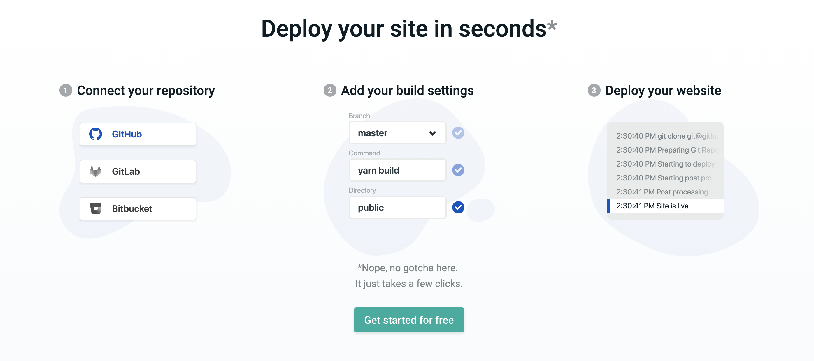

# 
    Radha Satam | Developer | Founder @ WE3 Solutions

---

# Introductions

---

# Build & Deploy Your Portfolio Website
    With Gatsby + Netlify

---

# Gatsby + Netlify

---

## we3academy-w1.netlify.com

---

## [JamStack](https://jamstack.org/)

---

## What's a [static site generator](https://www.staticgen.com/)? 

---

---

## Let's talk about [Gatsby](https://www.gatsbyjs.org/) 

---

    + Free and open source framework 

    + Based on React

    + Build blazing fast websites and apps

    + Plugins, starters and community support

---

--- 

setup

    npm install -g gatsby-cli

---

new site

    gatsby new website-name

---

clone a starter

    gatsby new my-blog-starter 
    https://github.com/gatsbyjs/gatsby-starter-blog

---

run site on localhost

    gatsby develop

---

Enough of that
## Let's code! ⚡

---

# [Netlify](https://www.netlify.com/) 

A static web host

---

---

## Let's Deploy Your Portfolio ! ⚡

---

## But wait, we need git...

---

# Questions?

---

